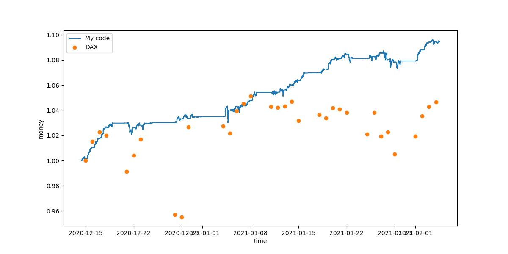

# auditor
Make money using bluestack stocks

This is a python program that I wrote, since a friend of mine would not believe that there are any patterns instocks that you can use to make money with them. Instead of working on historical data, where a simple error can lead to strong correlations (and your model can have biases) this works live. To do this I get the updates from boerse.de (see connect.py. Boerse.de migth actually not like this;)) and invest accordingly in a simulated environment (see history.csv for every transaction). I let this run 24/7 on a simple shell server (https://www.xshellz.com/) for the last weeks of december and I increase my money by 3.48%.

Depending on how strong your math background is, this is either very impressive or not impressive at all. 
First for those of you that think this is kind of boring: Inflation was 2019 about 1.4% (I ignore 2020 because less data/corona), interest on a simple banking account is about 0.02% currently (annually). That means my code doubles your winning of a whole year in about two weeks. And if you do not do this only for two weaks a year (but for 26* two weaks a year) this results in +143% each year. Finally if this is not enough, please notice that Christmas is about the worst possible time to test this algorithm, since stock markets are closed for christmas and in the rest of the time probably less people trade. You can interpret the plot below, as my code making most of its money in the first 4 days and if you extrapolate the profit in this time frame (2.98%) on the whole year (lets say 50 weaks with 5 days each=250 days=62.5 * 4 days) this would result in a yearly profit of +527%, which would be absolutely insane (for those with bad math skills: if your parents would have invested 1€ at the time of your birth, you would have been a millionaire at 8 years, and a billionaire before puberty and the richest person alive at about 14)

That beeing said, for those of you that think this is a bit to good to be true, let me point out some drawbacks:
First, my code does not differentiate between selling prices and buying prices. I do this, since the data I get from boerse.de does not include them nicely (ok they do include low and high values, but there could be biases that are introduced when I use them (I only get updates, they update slower and I cannot be sure that I catch all updates)). This obviosly reduces the profit, but assuming that the standart deviation of the stock is >> spread, which should always be true, since the time interval is very small, I only use Bluestack stocks(DAX) and in my code the standart deviation is bounded from below.
The second simplification is more numerical: I assume that I can trade any parts of a stock. If my programm wants to buy 1/(3* pi) VW stock, then it has a bit more than 10% of a VW stock more. This migth be really unrealistic, but does not matter in the case of infinite trading money (I guess you could say that the expected profit is higher than every interest, so trading money is (basically) infinite, but I think I am not brave enough for this) and it migth be really not important, since my code always buys for 10% of its current money reserves. So chancing this from something arbitrary to something more complicated migth actually increase the profit.
These were the simplifications I made, but I should also mention that the above investment strategy is a bit stupid: There is a maximum amount you can trade at the same time, since trading more increases the spread because of which the assumption in my first simplification is no longer given and so the profit falls.
Finally lets talk about statistics. I want to know if this value is statistically significant.
My first idea would be a binominal distribution: I have around 123k money updates, are there so much more growing ones compares to the falling ones, that I can excude the null hypothese (50%/50%). deltastat.py gives us about 50k chancing updates of which 50.8% are growing. The error of this value (assuming a binominal distribution) is ≈sqrt(N)/2≈100≈0.2%. So we can exclude the trivial hypothesis with around 4 sigma, which is not perfect, but quite good. That beeing said, bankinghistory.csv also updates when a stock that we bougth updates, but we do not care if it falls after we bougth it.
So lets do this differently: From 11 days with different values, 10 grow this value (91%). Assuming the same statistics as before sigma≈sqrt((10/121)* 11)≈1≈9% so 50% is excluded at 4.5sigma.
Sadly this still does not mean that my code works. Ignoring that the fraction of growing/falling timeframes does not really matter, this still assumes uncorrelated events, but stock data is messy and surely correlated over quite high timeframes. Basically to be completely sure this works, we would need to see similar effects at every possible timeframe.

One explanaition why my code reaches so high values is plotted into the following plot. In the time in which my code gained so much, also the DAX (on whichs stocks this code is build) grow strongly. But before you think that all my profit only stems from this DAX growth, notice two things: My code beat the DAX and more importantly it migth have grown with the DAX, but it does not fall when the DAX falls again. So the profit would be the same, if you assume that there is always at least one group of stocks (remember I am only using 30 stocks, while there are over 100k stocks (https://www.gurufocus.com/stock_list.php)) that grows similarly as the DAX mid december.

